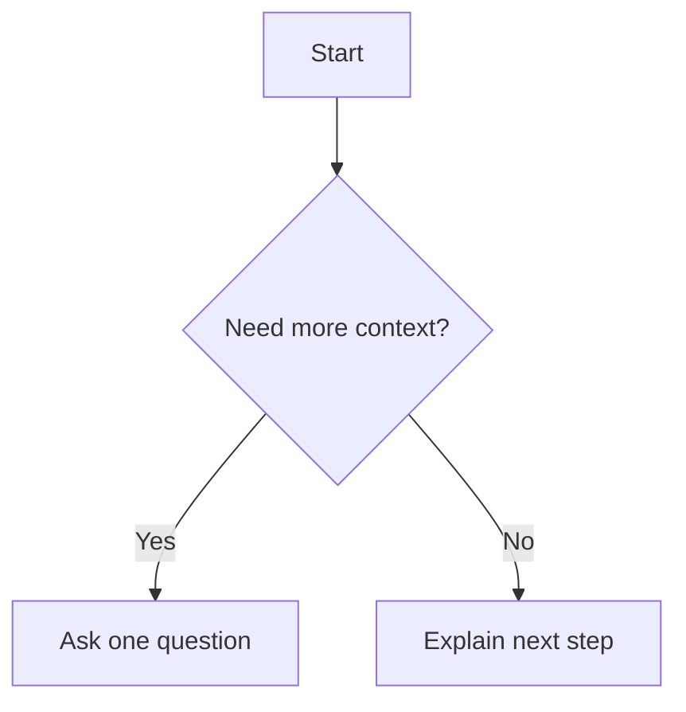

# Diagram Patterns

Use the smallest diagram that makes the idea clearer.

## Flowchart

Use for workflows and decision trees.

## Sequence

Use for request/response or event order.

## Tree

Use for project structure and dependency hierarchies.

## State

Use for lifecycle or mode changes.

## Rules

- One diagram, one question.
- Keep node count low.
- Keep labels concrete and project-specific.
- Use text first if the diagram is uncertain.
